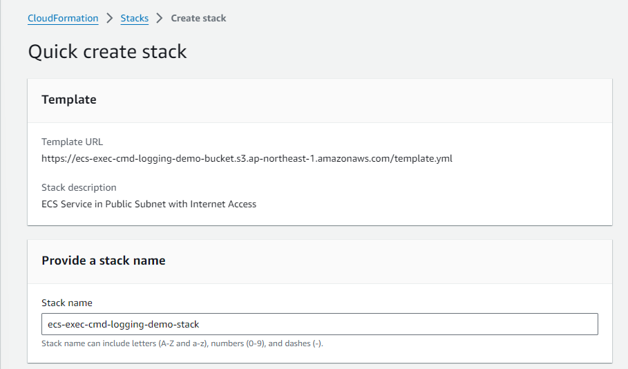
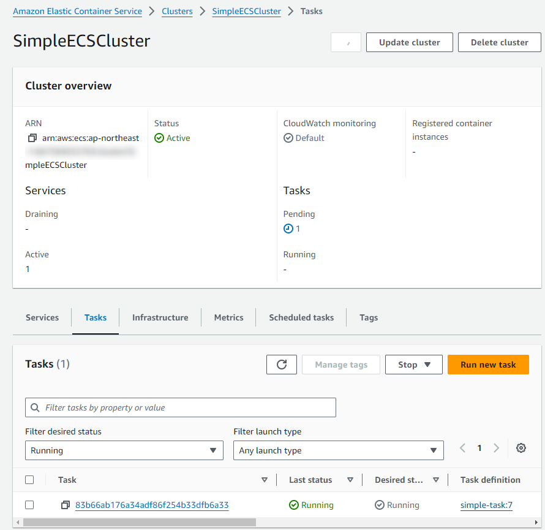
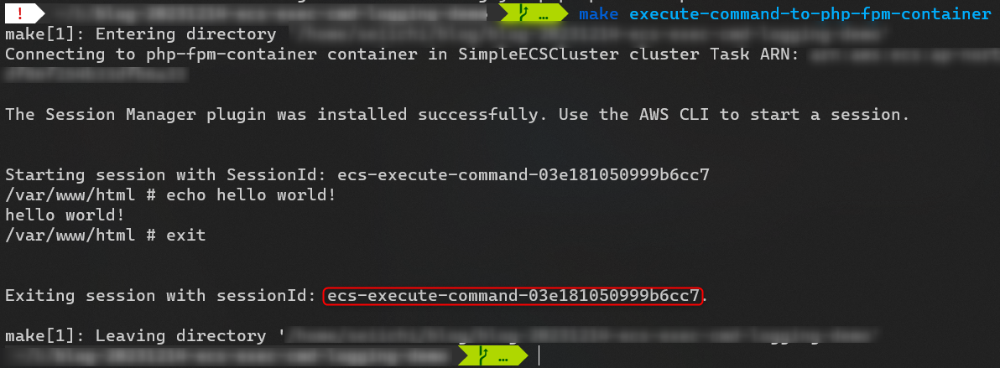
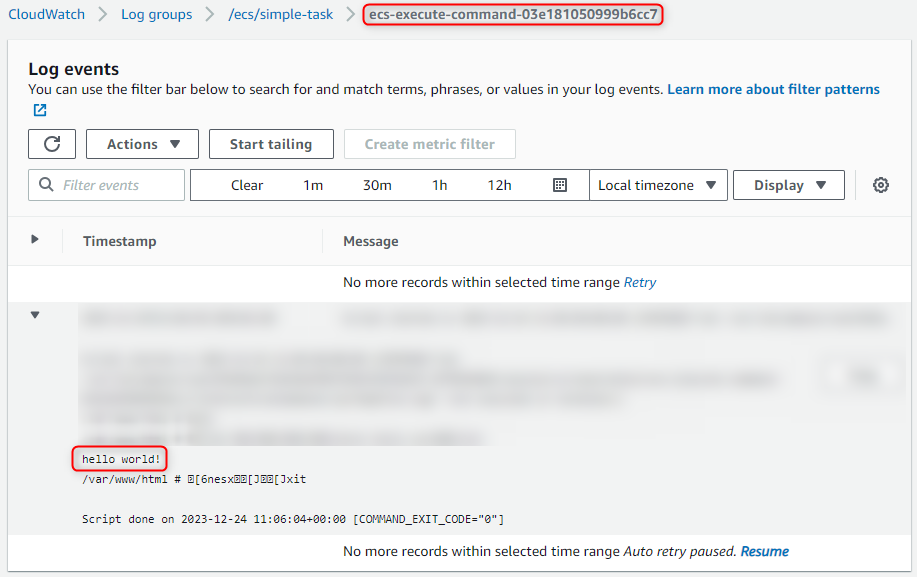

# ECS EXECUTION COMMAND LOGGING DEMO

Click Here: <a href="https://ap-northeast-1.console.aws.amazon.com/cloudformation/home?region=ap-northeast-1#/stacks/create/review?templateURL=https://ecs-exec-cmd-logging-demo-bucket.s3.ap-northeast-1.amazonaws.com/template.yml&stackName=ecs-exec-cmd-logging-demo-stack" target="_blank">**CloudFormation Deployment Link**</a>

## Deploy Demo Stack on AWS

## Run ECS Exec Command

## Check CloudWatch Logs

